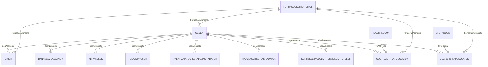

# IndexedDB adatbazis dokumentacio

## 1. Cel
Fobb elvek:
- A mezonevek magyarul, az Excelben szereplo mezonevekkel egyeznek.
- Az azonos mezonev kulon entitas, ha mas komponens-utvonal alatt szerepel.
- A kapcsolt es ismetlodo adatok kulon tablaban tarolodnak.
- Minden child tablaban kotelezo a `Komponens utvonal`.

## 2. Verziositas es migracio
- Adatbazis nev: `navigatorStudioDb`
- Kezdo semaverzio: `v1`
- Migracios strategia: additiv valtozasok (uj tabla, uj index, uj mezo), visszafele kompatibilis modon.

## 3. Kapcsolati attekintes



## 4. Tablak

### 4.1 CEGEK
Elsodleges kulcs: `CegAzonosito`

| Mezonev | Tipus | Kotelezo | Index | Megjegyzes |
|---|---|---|---|---|
| CegAzonosito | string | igen | PK | belso azonosito |
| Megnevezese | string | igen | igen | Excel: Megnevezese |
| Adoszama | string | igen | egyedi | Excel: Adoszama |
| Vamazonosito szama | string | nem | igen | Excel: Vamazonosito szama |
| Kozossegi adoszama | string | nem | igen | Excel: Kozossegi adoszama |
| Cegnyilvantartasi szama | string | nem | egyedi | Excel: Cegnyilvantartasi szama |
| Szekhelycime | string | nem | nem | Excel: Szekhelycime |
| Illetekessege (illetekes igazgatosag kodja es megnevezese) | string | nem | nem |  |
| Allapotkod es ervenyesseg kezdese | string | nem | nem | osszetett szoveg lehet |
| Adozoi minosites es az utolso minosites ervenyessegenek kezdete | string | nem | nem | osszetett szoveg lehet |
| AFA bevalloi jogcimkod es gyakorisag | string | nem | nem |  |
| Bevalloi tipuskod | string | nem | nem |  |
| Osszesito nyilatkozat gyakorisaga | string | nem | nem |  |
| Tao tv. hatalya ala tartozik-e, tao-alanyisag | string | nem | nem |  |
| Tevekenyseg kezdes datuma | string(date) | nem | igen |  |
| Alakulas modja | string | nem | nem | Excelben lehet zarojel/irasjel variacio |
| Fotevekenyseg | string | nem | nem | denormalizalt mezo |
| ForrasFajlAzonosito | string | igen | igen | import kovetes |
| LetrehozasIdeje | string(datetime) | igen | igen | technikai |
| ModositasIdeje | string(datetime) | igen | igen | technikai |

### 4.2 TEAOR_KODOK
Elsodleges kulcs: `TEAOR-kod`

| Mezonev | Tipus | Kotelezo | Index | Megjegyzes |
|---|---|---|---|---|
| TEAOR-kod | string | igen | PK | pl. 4664 |
| Megnevezes | string | igen | igen | TEAOR-kod es megnevezese bontasabol |

### 4.3 CEG_TEAOR_KAPCSOLATOK
Elsodleges kulcs: `CegTEAORKapcsolatAzonosito`

| Mezonev | Tipus | Kotelezo | Index | Megjegyzes |
|---|---|---|---|---|
| CegTEAORKapcsolatAzonosito | string | igen | PK | belso azonosito |
| CegAzonosito | string | igen | igen | FK -> CEGEK |
| TEAOR-kod | string | igen | igen | FK -> TEAOR_KODOK |
| TEAOR-kod es megnevezese | string | igen | nem | eredeti Excel ertek |
| Tipus | string | igen | igen | Fotevekenysege vagy Egyeb tevekenysegek |
| Ervenyesseg kezdet | string(date) | nem | igen | Excel: Ervenyesseg kezdet |
| Komponens utvonal | string | igen | igen | kotelezo |
| ForrasFajlAzonosito | string | igen | igen | import kovetes |
| LetrehozasIdeje | string(datetime) | igen | igen | technikai |
| ModositasIdeje | string(datetime) | igen | igen | technikai |

### 4.4 GFO_KODOK
Elsodleges kulcs: `GFO kodja`

| Mezonev | Tipus | Kotelezo | Index | Megjegyzes |
|---|---|---|---|---|
| GFO kodja | string | igen | PK | pl. 113 |
| Megnevezese | string | igen | igen | GFO kodja es megnevezese bontasabol |

### 4.5 CEG_GFO_KAPCSOLATOK
Elsodleges kulcs: `CegGFOKapcsolatAzonosito`

| Mezonev | Tipus | Kotelezo | Index | Megjegyzes |
|---|---|---|---|---|
| CegGFOKapcsolatAzonosito | string | igen | PK | belso azonosito |
| CegAzonosito | string | igen | igen | FK -> CEGEK |
| GFO kodja | string | igen | igen | FK -> GFO_KODOK |
| GFO kodja es megnevezese | string | igen | nem | eredeti Excel ertek |
| Ervenyesseg kezdete | string(date) | nem | igen | Excel: Ervenyesseg kezdete |
| Komponens utvonal | string | igen | igen | kotelezo |
| ForrasFajlAzonosito | string | igen | igen | import kovetes |
| LetrehozasIdeje | string(datetime) | igen | igen | technikai |
| ModositasIdeje | string(datetime) | igen | igen | technikai |

### 4.6 CIMEK
Elsodleges kulcs: `CimAzonosito`

| Mezonev | Tipus | Kotelezo | Index | Megjegyzes |
|---|---|---|---|---|
| CimAzonosito | string | igen | PK | belso azonosito |
| CegAzonosito | string | igen | igen | FK -> CEGEK |
| CimTipus | string | igen | igen | Szekhelye, Telephelye(i), Iratorzesi hely |
| Cimadat | string | igen | nem | Excel: Cimadat |
| Ervenyesseg kezdete | string(date) | nem | igen | Excel: Ervenyesseg kezdete |
| Komponens utvonal | string | igen | igen | kotelezo |
| ForrasFajlAzonosito | string | igen | igen | import kovetes |
| LetrehozasIdeje | string(datetime) | igen | igen | technikai |
| ModositasIdeje | string(datetime) | igen | igen | technikai |

### 4.7 BANKSZAMLASZAMOK
Elsodleges kulcs: `BankszamlaAzonosito`

| Mezonev | Tipus | Kotelezo | Index | Megjegyzes |
|---|---|---|---|---|
| BankszamlaAzonosito | string | igen | PK | belso azonosito |
| CegAzonosito | string | igen | igen | FK -> CEGEK |
| szamla szama | string | igen | igen | Excel mezonev szandekosan kisbetus |
| ervenyesseg kezdese | string(date) | nem | igen | Excel mezonev szandekosan kisbetus |
| Komponens utvonal | string | igen | igen | kotelezo |
| ForrasFajlAzonosito | string | igen | igen | import kovetes |
| LetrehozasIdeje | string(datetime) | igen | igen | technikai |
| ModositasIdeje | string(datetime) | igen | igen | technikai |

### 4.8 KEPVISELOK
Elsodleges kulcs: `KepviseloAzonosito`

| Mezonev | Tipus | Kotelezo | Index | Megjegyzes |
|---|---|---|---|---|
| KepviseloAzonosito | string | igen | PK | belso azonosito |
| CegAzonosito | string | igen | igen | FK -> CEGEK |
| nev/elnevezes | string | igen | igen | Excel mezonev szandekosan kisbetus |
| adoazonosito jel/adoszam | string | nem | igen |  |
| kepviselet jellege (torvenyes kepviselo, szervezeti kepviselo, felszamolo, vegelszamolo) | string | nem | nem |  |
| kepviselet terjedelme (onallo, egyuttes, kepviseleti jogot nem gyakorol) | string | nem | nem |  |
| kepviseleti jog kezdete | string(date) | nem | igen |  |
| Komponens utvonal | string | igen | igen | kotelezo |
| ForrasFajlAzonosito | string | igen | igen | import kovetes |
| LetrehozasIdeje | string(datetime) | igen | igen | technikai |
| ModositasIdeje | string(datetime) | igen | igen | technikai |

### 4.9 TULAJDONOSOK
Elsodleges kulcs: `TulajdonosAzonosito`

| Mezonev | Tipus | Kotelezo | Index | Megjegyzes |
|---|---|---|---|---|
| TulajdonosAzonosito | string | igen | PK | belso azonosito |
| CegAzonosito | string | igen | igen | FK -> CEGEK |
| Termeszetes szemely | string | nem | nem | forras blokk neve |
| Neve | string | igen | igen |  |
| Adoazonosito jele | string | nem | igen |  |
| Lakohelye | string | nem | nem |  |
| Ervenyesseg kezdete | string(date) | nem | igen |  |
| Komponens utvonal | string | igen | igen | kotelezo |
| ForrasFajlAzonosito | string | igen | igen | import kovetes |
| LetrehozasIdeje | string(datetime) | igen | igen | technikai |
| ModositasIdeje | string(datetime) | igen | igen | technikai |

### 4.10 NYILATKOZATOK_ES_ADOZASI_ADATOK
Elsodleges kulcs: `NyilatkozatAzonosito`

| Mezonev | Tipus | Kotelezo | Index | Megjegyzes |
|---|---|---|---|---|
| NyilatkozatAzonosito | string | igen | PK | belso azonosito |
| CegAzonosito | string | igen | igen | FK -> CEGEK |
| Kategoria | string | igen | igen | pl. KIVA, AFA, MNB-arfolyam |
| MezoNev | string | igen | igen | pontos Excel mezonev |
| MezoErtek | string | nem | nem | mezo erteke |
| Ervenyesseg kezdete | string(date) | nem | igen | ha ertelmezheto |
| Komponens utvonal | string | igen | igen | kotelezo |
| ForrasFajlAzonosito | string | igen | igen | import kovetes |
| LetrehozasIdeje | string(datetime) | igen | igen | technikai |
| ModositasIdeje | string(datetime) | igen | igen | technikai |

### 4.11 KAPCSOLATTARTASI_ADATOK
Elsodleges kulcs: `KapcsolatAzonosito`

| Mezonev | Tipus | Kotelezo | Index | Megjegyzes |
|---|---|---|---|---|
| KapcsolatAzonosito | string | igen | PK | belso azonosito |
| CegAzonosito | string | igen | igen | FK -> CEGEK |
| Elektronikus elerhetosege | string | igen | igen | email lehet |
| Komponens utvonal | string | igen | igen | kotelezo |
| ForrasFajlAzonosito | string | igen | igen | import kovetes |
| LetrehozasIdeje | string(datetime) | igen | igen | technikai |
| ModositasIdeje | string(datetime) | igen | igen | technikai |

### 4.12 KORNYEZETVEDELMI_TERMEKDIJ_TETELEK
Elsodleges kulcs: `TermekdijTetelAzonosito`

| Mezonev | Tipus | Kotelezo | Index | Megjegyzes |
|---|---|---|---|---|
| TermekdijTetelAzonosito | string | igen | PK | belso azonosito |
| CegAzonosito | string | igen | igen | FK -> CEGEK |
| Leiras | string | igen | nem | tobb komponens alatt is lehet |
| Kezdes datum | string(date) | nem | igen | tobb komponens alatt is lehet |
| Komponens utvonal | string | igen | igen | kotelezo |
| ForrasFajlAzonosito | string | igen | igen | import kovetes |
| LetrehozasIdeje | string(datetime) | igen | igen | technikai |
| ModositasIdeje | string(datetime) | igen | igen | technikai |

### 4.13 FORRASDOKUMENTUMOK
Elsodleges kulcs: `ForrasFajlAzonosito`

| Mezonev | Tipus | Kotelezo | Index | Megjegyzes |
|---|---|---|---|---|
| ForrasFajlAzonosito | string | igen | PK | belso azonosito |
| ForrasFajlNev | string | igen | igen | pl. excel fajlnev |
| ForrasFajlHash | string | igen | egyedi | deduplikacio |
| ImportalasIdeje | string(datetime) | igen | igen | auditalas |
| ParserVerzio | string | igen | nem | importer verzio |
| SorokSzama | number | igen | nem | beolvasott sorok |

## 5. Import szabalyok
1. A mezonev kulcsok megegyeznek az Excelben latott magyar mezonevekkel.
2. Ha azonos mezonev tobb helyen szerepel, a `Komponens utvonal` alapjan kulon rekordkent kezeljuk.
3. A `TEAOR-kod es megnevezese` es `GFO kodja es megnevezese` mezo importkor bontando:
- kod resz -> kodtabla
- megnevezes resz -> kodtabla
- eredeti szoveg -> kapcsolotabla mezo
4. Last import wins: az aktualis allapotot az utolso ervenyes import adja.

## 6. Kotelezo indexek (minimum)
- CEGEK: `Adoszama (egyedi)`, `Cegnyilvantartasi szama (egyedi)`
- CEG_TEAOR_KAPCSOLATOK: `CegAzonosito`, `TEAOR-kod`, `Tipus`
- CEG_GFO_KAPCSOLATOK: `CegAzonosito`, `GFO kodja`
- CIMEK: `CegAzonosito`, `CimTipus`
- BANKSZAMLASZAMOK: `CegAzonosito`, `szamla szama`
- KEPVISELOK: `CegAzonosito`, `adoazonosito jel/adoszam`
- TULAJDONOSOK: `CegAzonosito`, `Adoazonosito jele`
- NYILATKOZATOK_ES_ADOZASI_ADATOK: `CegAzonosito`, `Kategoria`, `MezoNev`
- FORRASDOKUMENTUMOK: `ForrasFajlHash (egyedi)`

## 7. Nyitott pontok
- Datumformatum: minden datum ISO formara normalizalva legyen (`YYYY-MM-DD`) importkor.
- Ertek-bontas: ahol az Excel ertek kod es szoveg egyutt, ott parser szabalyok rögzitese szukseges.
- Kulcsstrategia: UUID vagy determinisztikus hash child rekordokhoz (duplikacio kezeles miatt).

## 8. Pontos Excel mezonevek (ekezetes, valtoztatas nelkul)
Az alabbi mezonevek es szekcio-nevek pontosan az Excelbol szarmaznak, ezeket kell mezonevkent hasznalni ott, ahol uzleti adatkulcsrol van szo.

```text
Kiemelt adatok
Megnevezése
Adószáma
Vámazonosító száma
Közösségi adószáma
Cégnyilvántartási száma
Székhelycíme
Illetékessége (illetékes igazgatóság kódja és megnevezése)
Állapotkód és érvényesség kezdése
Adózói minősítés és az utolsó minősítés érvényességének kezdete
ÁFA bevallói jogcímkód és gyakoriság
Bevallói típuskód
Összesítő nyilatkozat gyakorisága
Tao tv. hatálya alá tartozik-e, tao-alanyiság
Tevékenység kezdés dátuma
Alakulás módja
Főtevékenység

Címek
Székhelye
Telephelye(i)
Iratőrzési hely
Címadat
Érvényesség kezdete

Adóköteles tevékenységgel kapcsolatos adatok
Tevékenységek
Főtevékenysége
Egyéb tevékenységek
TEÁOR-kód és megnevezése
Érvényesség kezdet
Gazdálkodási formakód (GFO)
GFO kódja és megnevezése

Bankszámlaszámok
Cégbíróságtól/hitelintézettől érkezett pénzforgalmi számlaszámok
számla száma
érvényesség kezdése

Képviselők
Bíróságon bejelentett törvényes képviselők
név/elnevezés
adóazonosító jel/adószám
képviselet jellege (törvényes képviselő, szervezeti képviselő, felszámoló, végelszámoló)
képviselet terjedelme (önálló, együttes, képviseleti jogot nem gyakorol)
képviseleti jog kezdete

Tulajdonosok
Cégbejegyzésre kötelezett gazdasági társaság tagjai, tulajdonosai
Természetes személy
Neve
Adóazonosító jele
Lakóhelye

Speciális adózási módok
KIVA adózással kapcsolatos nyilatkozatok
KIVA adóalanyiság kezdete
Áfa-nyilatkozatok
Az áfa-fizetési kötelezettség megállapításának módja
Közösségi adószám igénylése vagy megszüntetése
Közösségi adószám
igénylésének oka
Az MNB- vagy EKB-árfolyam alkalmazásának bejelentése az Áfa-törvény 80. § (2) bekezdés b) pontja vagy 80/A. §-a alapján
MNB-árfolyam alkalmazásának kezdő dátuma

Nemzetközi és közösségi szintű adózással kapcsolatos adatok, nyilatkozatok
Vámazonosító szám (EORI/VPID) vonatkozásában bejelentendő adatok
Elektronikus elérhetősége

Környezetvédelmi termékdíjjal, átvállalási szerződésekkel kapcsolatos adatok
Kötelezetti státuszok és termékdíj átalányok
Kötelezetti státusz és termékdíj átalány
Termékkörök
Leírás
Kezdés dátum
```
